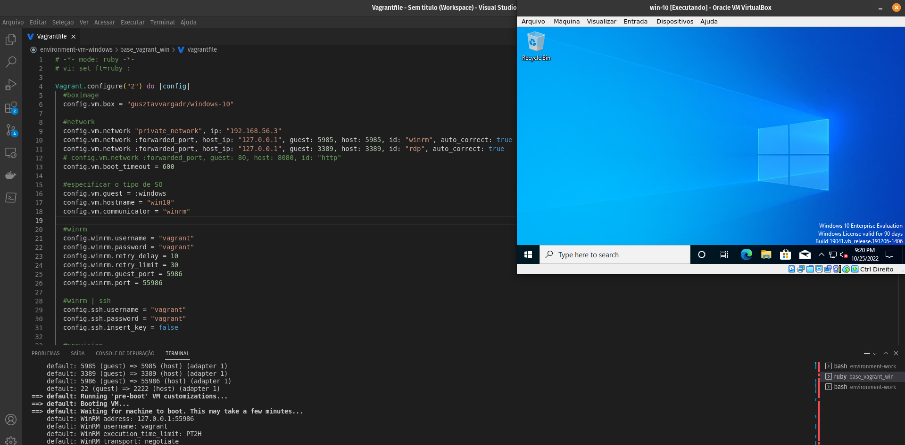

<h1 align="center">DevOps - Windows 10 com Vagrant e Virtualbox</h1>

<p align="center">
  
  
</p>


<p align="center">
  <a href="#-projeto">Projeto</a>&nbsp;&nbsp;&nbsp;|&nbsp;&nbsp;&nbsp;
  <a href="#-tecnologias">Tecnologias</a>&nbsp;&nbsp;&nbsp;|&nbsp;&nbsp;&nbsp;
  <a href="#-etapas">Etapas</a>&nbsp;&nbsp;&nbsp;|&nbsp;&nbsp;&nbsp;
  <a href="#-licença">Licença</a>&nbsp;&nbsp;&nbsp;|&nbsp;&nbsp;&nbsp;
  <a href="#-referências">Referências</a>
</p>

<p align="center">
  
</p>

## 🌱 Projeto

- Ambiente Windows 10 com `virtualbox` e `vagrant`

## ✨ Tecnologias

- Vagrant
- Virtualbox
- Windows 10

## 🚀 Etapas

- Pré-requisitos: `vagrant` e `virtualbox`
- Criar `Vagrantfile`
- Plugins Winrm: `winrm `, `winrm-fs` e `winrm-elevated`

```bash
$ vagrant plugin install winrm  
$ vagrant plugin install winrm-fs  
$ vagrant plugin install winrm-elevated
```

- Plugin Reload:  `vagrant-reload`

```bash
vagrant plugin install vagrant-reload
```

- Subir VM

```bash
vagrant up
```

- Parar VM

```bash
vagrant halt
```

- Desligar VM

```bash
vagrant destroy -f
```

## 📄 Licença

- Esse projeto está sob a licença MIT. Veja o arquivo [LICENSE](LICENSE) para mais detalhes.

## 🙇 Referências

- https://dev.to/sannae/setting-up-windows-virtual-test-environments-with-vagrant-4k1b
- https://developer.hashicorp.com/vagrant/docs/vagrantfile/machine_settings
- https://developer.hashicorp.com/vagrant/docs/providers/virtualbox/configuration
- https://gist.github.com/landonb/f1639d9a2c9a764831bde51f48ea05f4

## Test Net Connection

-  nc -z -w1 <IP or host name> 5986;echo $?